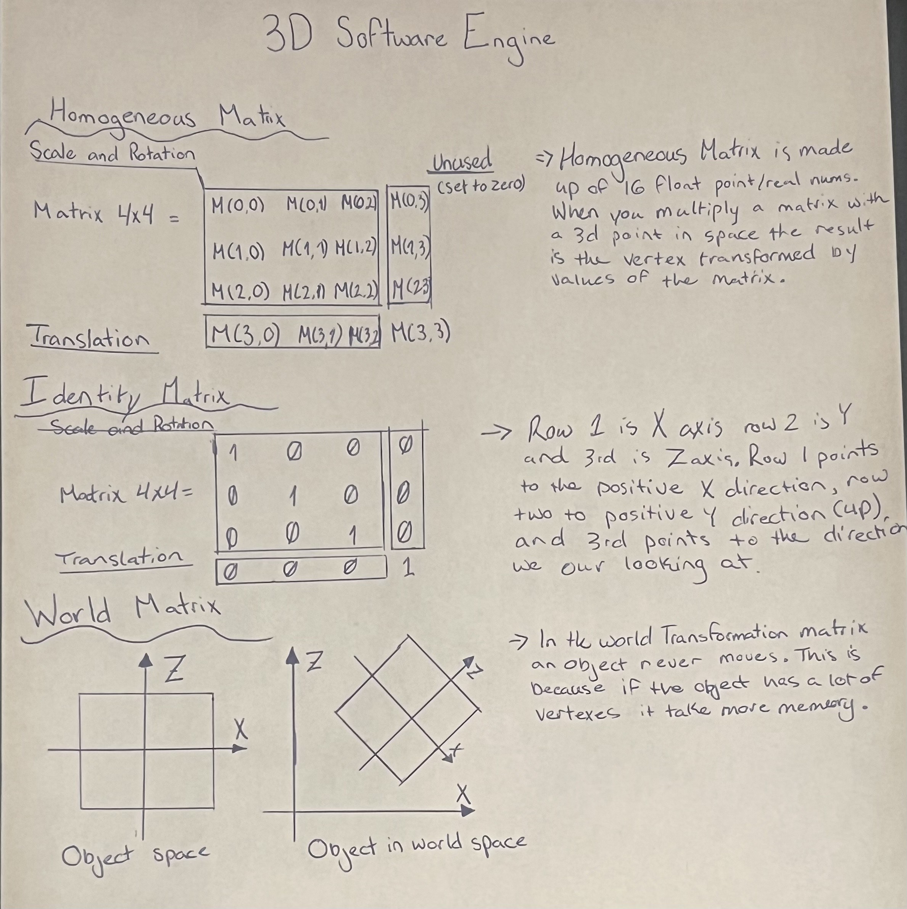

# Software-Engine
> By: Xavion Dean 

Building a rendering engine from the ground up in JavaScript. Implements a software rasterizer that handles triangle setup, texture mapping, and depth buffering without WebGL. A deep dive into the fundamentals of computer graphics.

## Why Build this 

I'm deeply interested in constructing `3D objects` through `mathematical` principles, which I believe offers an excellent opportunity to deepen my understanding of computer graphics fundamentals.

- In addition to being super informational I want to deepend my understanding of `Javascript` fundamentals 

## Research

**How Does 3D objects Work**

- Firstly we need to understand the underline principles behide `3D objects`

**The Matrix**

- In mathematics, a matrix is a rectangular array of numbers, symbols, or expressions organized into rows and columns.

- This is were us as software developers are assisted by mathematical equations.

## End Result

This is the end-goal of this project 
<video controls src="Recording 2025-09-30 202429.mp4" title="Title"></video>